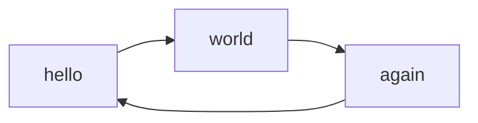

# examples

  
```python
def hello_world():
    print("Hello, world!")
```

```bash

#!/bin/bash
#==============================================
#    author      Oliver Guggenbuehl
#    birth       01.03.1982
#    e-mail      info@containerize.ch
#    Role        Technical Lead
#    Civilstatus: Married, 2 children
#==============================================
echo "working since more then 25+ years in IT"</code>
$[fedora]~% whoami
guo
alias olig="guo"
alias bigg01="guo"
alias tkggo="guo"
alias guggi="guo"
alias MrG="guo"
```

```go
package main

func main() {

}
```


<pre><code class="language-html">...</code></pre>




